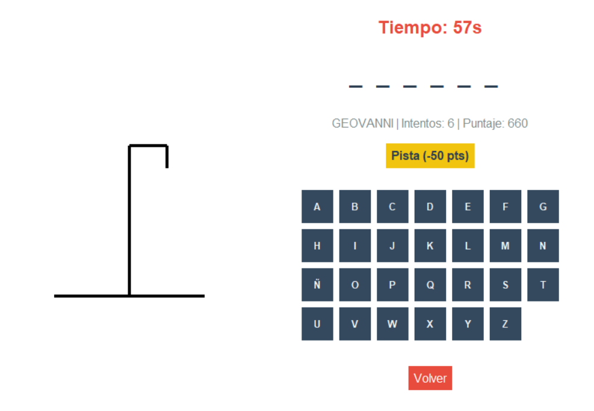

# Ahorcado GUI App

[](https://github.com/Geovanni-Gonzalez/Ahorcado-GUI-App/actions/workflows/ci.yml)

## Descripción
Versión gráfica del Ahorcado construida con Python y Tkinter. Incluye administración de contenido, modos de juego y persistencia mediante archivos.

## Objetivo
Llevar un juego de consola a una aplicación de escritorio con interfaz visual, eventos y separación entre lógica y presentación.

## Tecnologías utilizadas
- Python 3
- Tkinter
- Winsound en Windows
- Archivos .txt

## Funcionalidades principales
- Interfaz gráfica para jugar
- Módulo administrativo para palabras y frases
- Historial y datos persistidos
- Componentes gráficos separados

## Mi rol
Desarrollé la interfaz, conecté la lógica con eventos de Tkinter y organicé los módulos.

## Aprendizajes clave
- Programación orientada a eventos
- Separación lógica/UI
- Persistencia local desktop
- Manejo de ventanas y componentes

## Instalación y ejecución
```bash
cd Ahorcado-GUI-App/programa
python main.py
```

## Estructura del proyecto
- programa/main.py: entrada
- programa/src/logic.py: lógica
- programa/src/gui/: ventanas y componentes
- programa/data/: datos

## Capturas o demo


## Estado del proyecto
Proyecto académico funcional.

## Valor técnico demostrado
Demuestra capacidad para convertir reglas de negocio en una aplicación desktop usable.

## Mejoras futuras
- Agregar pruebas unitarias
- Centralizar rutas
- Documentar flujo administrativo

## Autor
Geovanni González  
Estudiante de Ingeniería en Computación  
GitHub: [Geovanni-Gonzalez](https://github.com/Geovanni-Gonzalez)


